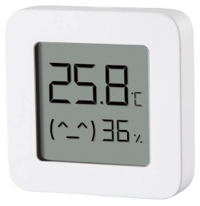
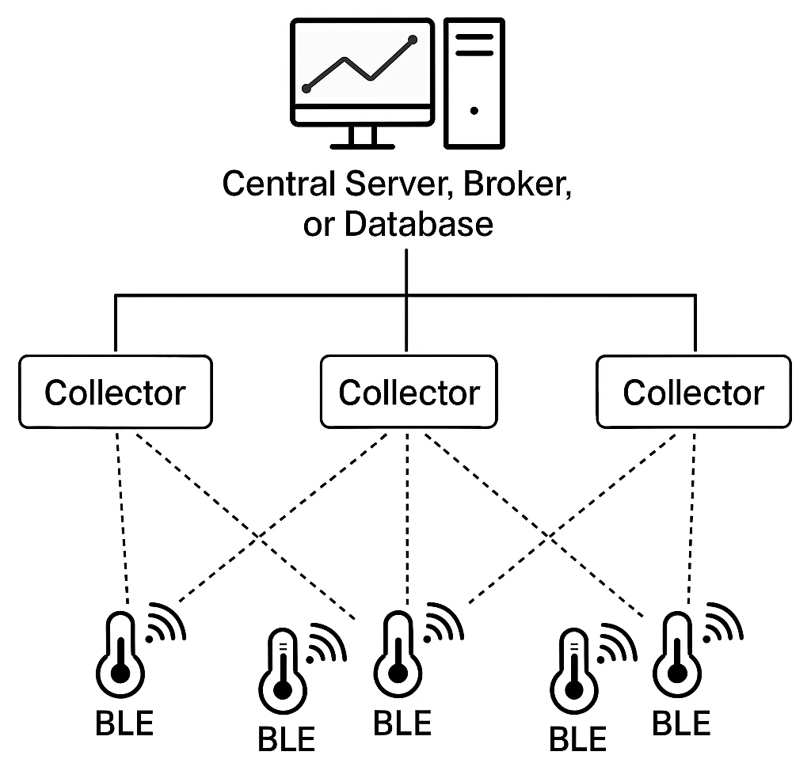
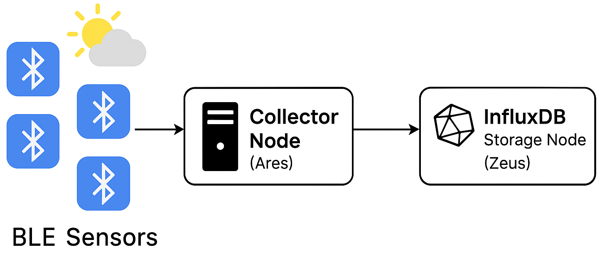

# Raspi-Enviro-Watch

Raspi-Enviro-Watch is a lightweight environmental monitoring project built around the Raspberry Pi and Xiaomi LYWSD03MMC sensors. It continuously collects real-time temperature, and humidity data from the surrounding environment via Bluetooth Low Energy (BLE).

Designed for reliability and efficiency, Raspi-Enviro-Watch enables seamless data acquisition suitable for home automation, greenhouse monitoring, or general ambient condition tracking. The collected data is sent to InfluxDB time-series database to enable deeper insights, historical analysis and visualization.

## Wireless Sensors

There are several wireless temperature and humidity sensors that can report data to a Raspberry Pi 5, using protocols like Wi-Fi, Bluetooth, or LoRa.

| Sensor Type                  | Protocol  | Battery Powered | Notes                                                           |
|------------------------------|-----------|-----------------|-----------------------------------------------------------------|
| Xiaomi Mijia LYWSD03MMC      | Bluetooth | Yes (CR2032)    | Hackable firmware available; widely used; inexpensive (~$10)    |
| Inkbird IBS-TH1 Mini         | Bluetooth | Yes             | Good range, supported by python-inkbird                         |
| RuuviTag                     | Bluetooth | Yes             | High precision; rugged design; supports logging                 |
| Sonoff SNZB-02               | Zigbee    | Yes             | Needs Zigbee2MQTT + USB coordinator                             |
| Shelly H&T                   | Wi-Fi     | Yes (AAA)       | Easy integration; standalone device with web server             |
| SwitchBot Meter/Meter Plus   | Bluetooth | Yes             | Can work with or without SwitchBot hub                          |

I decided to go with Xiaomi Mijia Thermometer 2!

## Xiaomi Mijia Thermometer 2

​The Xiaomi Mijia Thermometer 2 (model LYWSD03MMC) is a compact and affordable sensor based on Telink TLSR8258 SoC, designed for monitoring environmental conditions. With it's default firmware, it uses Bluetooth Low Energy (BLE) connectivity to ensure low-energy wireless communication, suitable for continuous monitoring without significant battery drain.

It can measures ambient temperatures ranging from 0°C to 60°C with a resolution of 0.1°C. It can also capture relative humidity levels between 0% and 99% RH with a resolution of 1% RH. It uses a CR2032 coin cell battery and provides battery voltage readings, allowing users to monitor the remaining charge of the battery. Last but not least, it features a LCD display that shows the current temperature and humidity readings, along with comfort level indicators.



The availability of hackable firmware provides greater flexibility and control over data formats and broadcast intervals, making them highly adaptable for scalable, battery-efficient environmental monitoring projects. By leveraging BLE and flashing custom firmware, these sensors can passively broadcast temperature and humidity data without requiring active polling, minimizing battery drain and network overhead.

Their compatibility with popular Python libraries like bleak and bluepy makes integration with the Raspberry Pi 5 straightforward. The LYWSD03MMC is popular among DIY enthusiasts and smart home users. It can be integrated into systems like Home Assistant, Node-RED, or custom InfluxDB setups for real-time monitoring, automation and visualization. Custom [firmware](https://smarthomescene.com/guides/convert-xiaomi-lywsd03mmc-from-bluetooth-to-zigbee/) is also available that can convert the LYWSD03MMC from Bluetooth to Zigbee.

## Getting Started

### Bluetooth Status

Check that the Raspberry Pi Bluetooth is enabled:

Install bluez package:

```bash
sudo apt  install bluez
```

If you see `Powered: yes`, Bluetooth is ON.

```bash
bluetoothctl show | grep Powered
    Powered: yes
```

### Scanning for Nearby BLE Devices

Set up a Python virtual environment and install the required dependencies listed in requirements.txt:

```bash
python3 -m venv venv
source venv/bin/activate
pip install -r requirements.txt
```

Use the `ble_scan.py` Python script to scan for nearby BLE devices every 2 seconds:

```bash
python3 ble_scan.py
```

Here is a sample output:

```text
+-------------------+----------------------------------------+------------------------------+------------+--------------+-------------+--------+--------+---------+---------+---------------+-----------+
|        MAC        |                Company                 |         Device Name          | RSSI (dBm) | Distance (m) | AddressType | Paired | Bonded | Trusted | Blocked | LegacyPairing | Connected |
+-------------------+----------------------------------------+------------------------------+------------+--------------+-------------+--------+--------+---------+---------+---------------+-----------+
| CB:9A:AA:A4:B1:85 |                Unknown                 |          OBT11C43C           |    -54     |     0.41     |   random    | False  | False  |  False  |  False  |     False     |   False   |
| BD:8C:DA:61:D5:11 |                Unknown                 |              TY              |    -65     |     2.01     |   public    | False  | False  |  False  |  False  |     False     |   False   |
| F4:FE:FB:B1:D3:8A |      Samsung Electronics Co.,Ltd       |  [AV] Samsung Soundbar Q90R  |    -68     |     2.8      |   public    | False  | False  |  False  |  False  |     False     |   False   |
| 76:C3:C5:79:D9:CF |                Unknown                 |           mamaRoo5           |    -76     |     6.45     |   random    | False  | False  |  False  |  False  |     False     |   False   |
| 4D:08:FF:E7:A6:EC |                Unknown                 |  [LG] webOS TV OLED77CXPUA   |    -83     |    12.61     |   random    | False  | False  |  False  |  False  |     False     |   False   |
| 88:57:1D:D2:1B:0D |        Seongji Industry Company        |     [oven]Samsung(359F)      |    -88     |    19.73     |   public    | False  | False  |  False  |  False  |     False     |   False   |
| 5C:C1:D7:D1:9B:53 |      Samsung Electronics Co.,Ltd       | [TV] Samsung Q80 Series (55) |    -89     |    21.52     |   public    | False  | False  |  False  |  False  |     False     |   False   |
+-------------------+----------------------------------------+------------------------------+------------+--------------+-------------+--------+--------+---------+---------+---------------+-----------+
```

The discovered devices are presented in a table, sorted by their signal strength (RSSI) — meaning that closer devices appear at the top of the list. A higher (less negative) RSSI value generally indicates a stronger signal and thus a closer device. For each discovered device, additional metadata is retrieved and displayed in the table. You can find a brief description of each metadata in the table below:

| **Column**        | **Description**                                                                               |
|-------------------|-----------------------------------------------------------------------------------------------|
| **MAC**           | The unique hardware address of the Bluetooth device (Media Access Control address).           |
| **Company**       | The company that manufactured the device, based on MAC address OUI lookup.                    |
| **Device Name**   | The advertised device name, if available, otherwise marked `unknown`.                         |
| **RSSI (dBm)**    | Received Signal Strength Indicator showing signal power in decibels relative to 1 milli-watt. |
| **Distance (m)**  | Estimated distance to the device, calculated based on the RSSI value.                         |
| **AddressType**   | Indicates whether the device uses a `public` or `random` MAC address.                         |
| **Paired**        | Whether the device is already paired with the scanner device.                                 |
| **Bonded**        | Whether the device has been bonded (authenticated and saved) before.                          |
| **Trusted**       | Whether the device is marked as trusted by the system.                                        |
| **Blocked**       | Whether the device has been blocked from connecting.                                          |
| **LegacyPairing** | Indicates if the device uses legacy (older) Bluetooth pairing methods.                        |
| **Connected**     | Shows if the device is currently connected.                                                   |

When the thermometer is turned on, it begins broadcasting BLE advertisements. During the next scan interval, the device should appear in the list of discovered devices, advertising its model number `LYWSD03MMC` as the device name.

```text
+-------------------+----------------------------------------+------------------------------+------------+--------------+-------------+--------+--------+---------+---------+---------------+-----------+
|        MAC        |                Company                 |         Device Name          | RSSI (dBm) | Distance (m) | AddressType | Paired | Bonded | Trusted | Blocked | LegacyPairing | Connected |
+-------------------+----------------------------------------+------------------------------+------------+--------------+-------------+--------+--------+---------+---------+---------------+-----------+
| A4:C1:38:AA:EA:0D | Telink Semiconductor (Taipei) Co. Ltd. |          LYWSD03MMC          |    -65     |     2.01     |   public    | False  | False  |  False  |  False  |     False     |   False   |
```

The default firmware of the device advertises its presence via BLE; however, it does not broadcast actual sensor data (temperature, humidity, battery level) in the advertisement packets. To access the thermometer's readings, you must establish a BLE connection first — then perform a GATT read to retrieve the data.

### GATT (Generic ATTribute Profile)

A GATT profile is a standardized framework that defines how a BLE device organizes its data and operations for communication. Within a GATT profile, the data is grouped into `services`, each representing a specific function or feature of the device (such as monitoring heart rate or battery level). Each service is made up of one or more `characteristics`, which are individual pieces of data or control points that can be interacted with. Every service and characteristic is identified by a globally unique `UUID` (Universally Unique Identifier), which ensures that devices can recognize and interpret them correctly across different manufacturers. In addition to the UUID, each element is also assigned a local `handle`, a numeric reference used internally by the BLE protocol for efficient access. Furthermore, every characteristic has associated `properties` that define how it can be used — for example, whether it can be read, written, or can notify the client when its value changes.

| Property              | Meaning                                                |
|-----------------------|--------------------------------------------------------|
| **READ**              | You can read the value.                                |
| **WRITE**             | You can send (write) a new value.                      |
| **WRITE NO RESPONSE** | Send data without waiting for acknowledgment (faster). |
| **NOTIFY**            | Device pushes updates automatically (no need to poll). |
| **INDICATE**          | Like NOTIFY, but requires acknowledgment by client.    |

You can use the `discover_service.py` Python script to discover all the GATT services provided by the device, and for each service, it lists all the characteristics along with their UUIDs, handles, and properties. The script essentially maps out the BLE device's service and characteristic structure, helping you understand what data you can access or interact with on that device. Make sure to set the `mac_address` variable in the script.

```bash
python3 discover_service.py
```

```text
Service: 00001800-0000-1000-8000-00805f9b34fb
  Characteristic: 00002a00-0000-1000-8000-00805f9b34fb (Handle: 0x0003) - Properties: READ NOTIFY
  Characteristic: 00002a01-0000-1000-8000-00805f9b34fb (Handle: 0x0005) - Properties: READ
  Characteristic: 00002a04-0000-1000-8000-00805f9b34fb (Handle: 0x0007) - Properties: READ
Service: 00001801-0000-1000-8000-00805f9b34fb
  Characteristic: 00002a05-0000-1000-8000-00805f9b34fb (Handle: 0x000a) - Properties: INDICATE
Service: 0000180a-0000-1000-8000-00805f9b34fb
  Characteristic: 00002a24-0000-1000-8000-00805f9b34fb (Handle: 0x000e) - Properties: READ
  Characteristic: 00002a25-0000-1000-8000-00805f9b34fb (Handle: 0x0010) - Properties: READ
  Characteristic: 00002a26-0000-1000-8000-00805f9b34fb (Handle: 0x0012) - Properties: READ
  Characteristic: 00002a27-0000-1000-8000-00805f9b34fb (Handle: 0x0014) - Properties: READ
  Characteristic: 00002a28-0000-1000-8000-00805f9b34fb (Handle: 0x0016) - Properties: READ
  Characteristic: 00002a29-0000-1000-8000-00805f9b34fb (Handle: 0x0018) - Properties: READ
Service: 00010203-0405-0607-0809-0a0b0c0d1912
  Characteristic: 00010203-0405-0607-0809-0a0b0c0d2b12 (Handle: 0x001b) - Properties: READ WRITE NO RESPONSE NOTIFY
Service: ebe0ccb0-7a0a-4b0c-8a1a-6ff2997da3a6
  Characteristic: ebe0ccb7-7a0a-4b0c-8a1a-6ff2997da3a6 (Handle: 0x0020) - Properties: READ WRITE
  Characteristic: ebe0ccb9-7a0a-4b0c-8a1a-6ff2997da3a6 (Handle: 0x0023) - Properties: READ
  Characteristic: ebe0ccba-7a0a-4b0c-8a1a-6ff2997da3a6 (Handle: 0x0026) - Properties: READ WRITE
  Characteristic: ebe0ccbb-7a0a-4b0c-8a1a-6ff2997da3a6 (Handle: 0x0029) - Properties: READ
  Characteristic: ebe0ccbc-7a0a-4b0c-8a1a-6ff2997da3a6 (Handle: 0x002c) - Properties: NOTIFY
  Characteristic: ebe0ccbe-7a0a-4b0c-8a1a-6ff2997da3a6 (Handle: 0x0030) - Properties: READ WRITE
  Characteristic: ebe0ccc1-7a0a-4b0c-8a1a-6ff2997da3a6 (Handle: 0x0033) - Properties: READ NOTIFY
  Characteristic: ebe0ccc4-7a0a-4b0c-8a1a-6ff2997da3a6 (Handle: 0x0037) - Properties: READ
  Characteristic: ebe0ccc8-7a0a-4b0c-8a1a-6ff2997da3a6 (Handle: 0x003a) - Properties: WRITE
  Characteristic: ebe0ccd1-7a0a-4b0c-8a1a-6ff2997da3a6 (Handle: 0x003d) - Properties: WRITE
  Characteristic: ebe0ccd7-7a0a-4b0c-8a1a-6ff2997da3a6 (Handle: 0x0040) - Properties: READ WRITE
  Characteristic: ebe0ccd8-7a0a-4b0c-8a1a-6ff2997da3a6 (Handle: 0x0043) - Properties: WRITE
  Characteristic: ebe0ccd9-7a0a-4b0c-8a1a-6ff2997da3a6 (Handle: 0x0046) - Properties: WRITE NOTIFY
  Characteristic: ebe0cff1-7a0a-4b0c-8a1a-6ff2997da3a6 (Handle: 0x004a) - Properties: READ WRITE
Service: fafafa00-fafa-fafa-fafa-fafafafafafa
  Characteristic: fafafa01-fafa-fafa-fafa-fafafafafafa (Handle: 0x004e) - Properties: READ WRITE
Service: 8edffff0-3d1b-9c37-4623-ad7265f14076
  Characteristic: 8edffff1-3d1b-9c37-4623-ad7265f14076 (Handle: 0x0052) - Properties: READ
  Characteristic: 8edffff3-3d1b-9c37-4623-ad7265f14076 (Handle: 0x0055) - Properties: NOTIFY
  Characteristic: 8edffff4-3d1b-9c37-4623-ad7265f14076 (Handle: 0x0059) - Properties: READ WRITE
  Characteristic: 8edfffef-3d1b-9c37-4623-ad7265f14076 (Handle: 0x005c) - Properties: READ NOTIFY
Service: 0000fe95-0000-1000-8000-00805f9b34fb
  Characteristic: 00000004-0000-1000-8000-00805f9b34fb (Handle: 0x0061) - Properties: READ
  Characteristic: 00000010-0000-1000-8000-00805f9b34fb (Handle: 0x0063) - Properties: WRITE NO RESPONSE NOTIFY
  Characteristic: 00000017-0000-1000-8000-00805f9b34fb (Handle: 0x0066) - Properties: WRITE NOTIFY
  Characteristic: 00000018-0000-1000-8000-00805f9b34fb (Handle: 0x0069) - Properties: WRITE NO RESPONSE NOTIFY
  Characteristic: 00000019-0000-1000-8000-00805f9b34fb (Handle: 0x006c) - Properties: WRITE NO RESPONSE NOTIFY
  Characteristic: 0000001a-0000-1000-8000-00805f9b34fb (Handle: 0x006f) - Properties: WRITE NO RESPONSE NOTIFY
  Characteristic: 0000001b-0000-1000-8000-00805f9b34fb (Handle: 0x0072) - Properties: WRITE NO RESPONSE NOTIFY
  Characteristic: 0000001c-0000-1000-8000-00805f9b34fb (Handle: 0x0075) - Properties: WRITE NO RESPONSE NOTIFY
  ```

Services in BLE can be either `standard` or `vendor-specific`. Standard services are defined by the Bluetooth SIG (Special Interest Group) and are universally recognized across devices to provide common functionality, such as device information and connection management. Vendor-specific services are custom-defined by manufacturers to implement proprietary features or data exchanges that fall outside the official Bluetooth specification; they typically use randomly generated UUIDs and require vendor-specific knowledge to interpret. Additionally, some services are classified as Standard (Company Assigned), meaning the UUID is officially registered by a company (such as Xiaomi) with the Bluetooth SIG, combining elements of standardization with custom functionality.

| Service UUID                           | Service Type                | Description                                                                                              |
|:---------------------------------------|:----------------------------|:---------------------------------------------------------------------------------------------------------|
| `00001800-0000-1000-8000-00805f9b34fb` | Standard                    | **Generic Access (GAP)** — device name, appearance, and connection parameters.                           |
| `00001801-0000-1000-8000-00805f9b34fb` | Standard                    | **Generic Attribute (GATT)** — service change notifications.                                             |
| `0000180a-0000-1000-8000-00805f9b34fb` | Standard                    | **Device Information Service (DIS)** — model, serial, firmware, and manufacturer info.                   |
| `00010203-0405-0607-0809-0a0b0c0d1912` | Vendor-Specific             | Custom service — no public standard, device-specific features.                                           |
| `ebe0ccb0-7a0a-4b0c-8a1a-6ff2997da3a6` | Vendor-Specific             | Common in **Mijia/Xiaomi BLE** sensors — handles environmental data (temp/humidity).                     |
| `fafafa00-fafa-fafa-fafa-fafafafafafa` | Vendor-Specific             | Placeholder-style custom service — used for custom application-specific data.                            |
| `8edffff0-3d1b-9c37-4623-ad7265f14076` | Vendor-Specific             | Custom service — possibly for additional sensor data or special commands.                                |
| `0000fe95-0000-1000-8000-00805f9b34fb` | Standard (Company Assigned) | **Xiaomi Inc. (assigned number)** — special service for Xiaomi BLE devices (e.g., binding, OTA updates). |

### Reading BLE Device Characteristics

The `sensor_read.py` Python script connects to the BLE device (specified by a MAC address) and reads all readable characteristics from it.

```bash
python3 sensor_read.py
```

It does this in two phases:

- **Phase 1** — Discover Readable Characteristics (using `bluepy`):

    Connects to the BLE device using bluepy.

    Iterates over all services and characteristics.

    Collects the UUIDs of all characteristics that support the "READ" property.

    Disconnects from the device after collecting UUIDs.

- **Phase 2** — Read and Decode Data (using `bleak`):

    Asynchronously connects to the same BLE device using bleak.

    For each collected UUID, attempts to read the characteristic value.

    Tries to decode each value into a human-readable UTF-8 string (if possible).

Here is a sample output:

```text
(00002a00-0000-1000-8000-00805f9b34fb): LYWSD03MMC     ----> Device Name
(00002a01-0000-1000-8000-00805f9b34fb): Characteristic 00002a01-0000-1000-8000-00805f9b34fb was not found!  ----> Appearance
(00002a04-0000-1000-8000-00805f9b34fb): Characteristic 00002a04-0000-1000-8000-00805f9b34fb was not found!  ----> Peripheral Preferred Connection
(00002a24-0000-1000-8000-00805f9b34fb): LYWSD03MMC            ----> Model Number
(00002a25-0000-1000-8000-00805f9b34fb): F2.0-CFMK-LB-JHBD-03  ----> Serial Number
(00002a26-0000-1000-8000-00805f9b34fb): 2.1.1_0159            ----> Firmware Revision
(00002a27-0000-1000-8000-00805f9b34fb): B1.5                  ----> Hardware Revision
(00002a28-0000-1000-8000-00805f9b34fb): 0159                  ----> Software Revision
(00002a29-0000-1000-8000-00805f9b34fb): miaomiaoce.com        ----> Manufacturer Name

(00010203-0405-0607-0809-0a0b0c0d2b12):
(ebe0ccb7-7a0a-4b0c-8a1a-6ff2997da3a6): d15b0000    ----> Time
(ebe0ccb9-7a0a-4b0c-8a1a-6ff2997da3a6): 0500000006000000
(ebe0ccba-7a0a-4b0c-8a1a-6ff2997da3a6):
(ebe0ccbb-7a0a-4b0c-8a1a-6ff2997da3a6): 0500000060540000fc002ef2002b
(ebe0ccbe-7a0a-4b0c-8a1a-6ff2997da3a6):             ----> Units
(ebe0ccc1-7a0a-4b0c-8a1a-6ff2997da3a6): bf092c8d0b  ----> temperature, humidity and voltage
(ebe0ccc4-7a0a-4b0c-8a1a-6ff2997da3a6): d           ----> Battery
(ebe0ccd7-7a0a-4b0c-8a1a-6ff2997da3a6): 8c0a6c075514
(ebe0cff1-7a0a-4b0c-8a1a-6ff2997da3a6):
(fafafa01-fafa-fafa-fafa-fafafafafafa):
(8edffff1-3d1b-9c37-4623-ad7265f14076): 0500000006000000
(8edffff4-3d1b-9c37-4623-ad7265f14076):
(8edfffef-3d1b-9c37-4623-ad7265f14076): bf092c8d0b
(00000004-0000-1000-8000-00805f9b34fb): 2.1.1_0159
```

The second half are Vendor-Specific UUIDs (proprietary Xiaomi services). Through a combination of reverse engineering and research, it is possible to determine how to extract sensor data from the raw hexadecimal values. The `sensor_read_decode.py` Python script can read and decode these sensor parameters.

```bash
python3 sensor_read_decode.py
```

Sample output:

```text
temperature: 21.25 C, humidity: 50 %, voltage: 2.994, estimated_battery: 89 %
battery: 100 %
time: 1970-01-01 09:08:57
```

The standard BLE characteristic for reporting battery level on LYWSD03MMC is unreliable. It consistently shows 99–100% battery, regardless of the actual charge state, and sometimes briefly reports 10% when the battery is nearly depleted. However, by that point, the device typically shuts down before updating the reading.

In practice, the sensor also transmits the raw battery voltage during normal measurements, which provides a more accurate basis for estimating battery health. [Testing](https://github.com/JsBergbau/MiTemperature2/issues/1#issuecomment-588156894) with an adjustable power supply showed that the sensor operates between 2.1V and 3.0V. When the voltage drops to around 2.1V, the low battery icon appears on the LCD, and the device reports a lower value. This change can take some time—sometimes over an hour—to reflect. Below 2.09V, the sensor turns off completely. Therefore, a more accurate battery percentage estimate is obtained by mapping voltages linearly from 3.1V (100%) to 2.1V (0%).

### Using NOTIFY

In BLE, a NOTIFY means the device can push updates to you automatically when its value changes — without you needing to poll (read) repeatedly. After subscribing, the device sends the values about every 6 seconds. The `sensor_notify.py` Python script connects to a BLE sensor using the bleak library, subscribes to **EBE0CCC1-7A0A-4B0C-8A1A-6FF2997DA3A6** which is the data characteristic for temperature, humidity, and voltage. It then listens for real-time incoming sensor values for 60 seconds and decodes and prints each value to the console.

```bash
python3 sensor_notify.py
```

Sample output:

```text
Subscribed to notifications. Listening...
2025-04-26 11:15:05 Sender: ebe0ccc1-7a0a-4b0c-8a1a-6ff2997da3a6 Temperature:  23.49 °C Humidity:  45 % Voltage:  3.02 V Estimated Battery:  92 %
2025-04-26 11:15:11 Sender: ebe0ccc1-7a0a-4b0c-8a1a-6ff2997da3a6 Temperature:  23.51 °C Humidity:  45 % Voltage:  3.02 V Estimated Battery:  92 %
2025-04-26 11:15:17 Sender: ebe0ccc1-7a0a-4b0c-8a1a-6ff2997da3a6 Temperature:  23.53 °C Humidity:  45 % Voltage:  3.02 V Estimated Battery:  92 %
2025-04-26 11:15:23 Sender: ebe0ccc1-7a0a-4b0c-8a1a-6ff2997da3a6 Temperature:  23.51 °C Humidity:  45 % Voltage:  3.02 V Estimated Battery:  92 %
2025-04-26 11:15:29 Sender: ebe0ccc1-7a0a-4b0c-8a1a-6ff2997da3a6 Temperature:  23.53 °C Humidity:  45 % Voltage:  3.02 V Estimated Battery:  92 %
2025-04-26 11:15:35 Sender: ebe0ccc1-7a0a-4b0c-8a1a-6ff2997da3a6 Temperature:  23.55 °C Humidity:  45 % Voltage:  3.02 V Estimated Battery:  92 %
2025-04-26 11:15:41 Sender: ebe0ccc1-7a0a-4b0c-8a1a-6ff2997da3a6 Temperature:  23.51 °C Humidity:  45 % Voltage:  3.02 V Estimated Battery:  92 %
2025-04-26 11:15:47 Sender: ebe0ccc1-7a0a-4b0c-8a1a-6ff2997da3a6 Temperature:  23.54 °C Humidity:  45 % Voltage:  3.02 V Estimated Battery:  92 %
2025-04-26 11:15:53 Sender: ebe0ccc1-7a0a-4b0c-8a1a-6ff2997da3a6 Temperature:  23.54 °C Humidity:  45 % Voltage:  3.02 V Estimated Battery:  92 %
2025-04-26 11:15:59 Sender: ebe0ccc1-7a0a-4b0c-8a1a-6ff2997da3a6 Temperature:  23.56 °C Humidity:  45 % Voltage:  3.02 V Estimated Battery:  92 %
```

### Writing to BLE Device

We can write data to the  BLE device to control its settings. For example, `sensor_write.py` Python script shows how to change the temperature unit displayed by the device between Celsius (°C) and Fahrenheit (°F). It connects to the BLE device, writes the desired unit setting, and reads back the configured value.

## BLE Key

The BLE Key (sometimes called the Bind Key) is a security credential used to enable encrypted communication between a BLE device and an application, such as the Mi Home app or custom scripts. It becomes necessary once the device is paired and transitions to using authenticated BLE connections, protecting actions like secure firmware updates. The BLE Key is used in direct Bluetooth connections — for example, when a Raspberry Pi or mobile app communicates with the device over BLE. This key is generated during the initial pairing or binding process within the Xiaomi ecosystem, typically when adding the device through the Mi Home app.

To obtain the BLE Key for a Xiaomi device, first install the `Xiaomi Home` app on your mobile device. Create an account using your email address and set a password. Once registered, add your BLE device to the app and complete the binding process. After successfully pairing the device, you can retrieve the BLE Key by using the open-source tool [Xiaomi Cloud Tokens Extractor](https://github.com/PiotrMachowski/Xiaomi-cloud-tokens-extractor). Follow the instructions in the repository to run the script.

```bash
python3 token_extractor.py
```

```text
---------
NAME:     Temperature & humidity sensor
ID:       blt.2.1l5u9vpgpo800
BLE KEY:  4884d1f7e3e907e7f0dce492f61c836e
MAC:      A4:C1:38:AA:EA:0D
IP:       76.14.48.209
TOKEN:    dbcb2c43d519b1f1a2e73b5a
MODEL:    miaomiaoce.sensor_ht.t2
---------
```

The python script securely connects to your Xiaomi account and extracts the `token` and `ble key` associated with your devices. The key is essential for enabling secure BLE communication outside of the Xiaomi ecosystem, such as when connecting via custom scripts or home automation platforms.

## ATC_MiThermometer Custom Firmware

The default LYWSD03MMC firmware does not broadcast its readings in BLE advertisements. To access data, a direct Bluetooth connection is required. Once connected, the device transmits temperature, humidity, and voltage data approximately every 6 seconds. When you're connected to the device no other connections is accepted, meaning if you hold the connection no other applications can readout sensor data.

The [ATC_MiThermometer](https://github.com/atc1441/ATC_MiThermometer) project provides custom firmware for LYWSD03MMC, enhancing their functionality for home automation and data logging applications. Flashing ATC_MiThermometer custom firmware enables the sensor to broadcast data in BLE advertisements, allowing for passive data collection without maintaining a continuous connection. This approach is more battery-efficient and facilitates integration with various home automation platforms.

The custom firmware sends sensor data every minute using the standard Environmental Sensing UUID (`0x181A`), but the data structure inside the advertisement packet follows a custom format defined below:

| Byte Range (0-based) | Description                             | Data Type   |
|:---------------------|:----------------------------------------|:------------|
| 0–5                  | MAC address (correct order)             | 6 bytes     |
| 6–7                  | Temperature (× 10, big-endian, signed)  | int16       |
| 8                    | Humidity percentage                     | uint8       |
| 9                    | Battery level percentage                | uint8       |
| 10–11                | Battery voltage (in mV, big-endian)     | uint16      |
| 12                   | Frame packet counter                    | uint8       |

The temperature value is an `int16` and must be divided by 10 to get the actual temperature. The MAC address is sent in correct, human-readable order (not reversed). Furthermore, the frame counter increments with each advertisement, which helps detect missed transmissions. This custom format allows easy parsing without needing encryption keys or active connections.

### Flashing Custom Firmware

There are two primary methods to flash the ATC_MiThermometer custom firmware onto the LYWSD03MMC device:

- Over-the-Air (OTA):

    - Obtain device id, token, and BLE key using [Xiaomi Cloud Tokens Extractor](https://github.com/PiotrMachowski/Xiaomi-cloud-tokens-extractor) described [here](#ble-key).
    - Open the [TelinkFlasher](https://atc1441.github.io/TelinkFlasher.html) in a browser such as Chrome.
    - Enable experimental web platform features in your browser (ex. chrome://flags/#enable-experimental-web-platform-features)
    - Click on "Connect" to connect to the Xiaomi thermometer; note that discovery may take some time due to the device's low advertising frequency.
    - Copy and paste device id, token, and BLE key in the form.
    - Click on "Do via Login" to authorize the connection.
    - Download the [ATC_Exploit.bin](https://github.com/atc1441/ATC_MiThermometer/blob/master/ATC_Exploit.bin) file.
    - Select the firmware file and initiate the flashing process.​

- USB to UART (Serial):

  For devices that cannot be flashed OTA, the firmware can be uploaded via a USB to UART adapter.

  Refer to the custom firmware repository for detailed instruction.

Once the custom firmware has been successfully flashed to the BLE device, you can reconnect to it using the same web portal. The device will advertise a new name based on its MAC address, prefixed with "ATC" (e.g., `ATC_AAEA0D`). Additionally, the web portal will display a log message such as "Detected custom Firmware," confirming that the custom firmware has been properly loaded onto the device.

### Custom Firmware Configuration

The ATC_MiThermometer custom firmware allows real-time configuration changes directly from the TelinkFlasher web portal, which are immediately written to the device without requiring a firmware re-flashing. You can configure the following:

- Advertising Type: Select how data is advertised over BLE. Custom format (default) or Mi-Like format (compatible with Xiaomi apps).

- Advertising Interval: Set how often updated sensor values are broadcasted over BLE (default is 60 seconds).

- Temperature Unit Selection: Choose between °C (Celsius) and °F (Fahrenheit) for display. Default is Celsius.

- Temperature and Humidity Offset Calibration: Apply manual offsets to temperature (±12.8 °C) and humidity (±50%) readings for calibration purposes.

- Instant Advertising on Rapid Changes: Enable immediate BLE advertising if temperature or humidity changes exceed a threshold:

    - Temperature alarm: configurable from 0.1 °C to 25.5 °C (default: 0.5 °C)
    - Humidity alarm: configurable from 1% to 50% (default: 5%)

- Battery Level Display: Show either battery percentage or humidity percentage alternately every ~5–6 seconds.

- Smiley Face Display Behavior: Control the smiley icon shown on the screen.

### BLE Passive Data Collection

Installing the custom firmware on the LYWSD03MMC enables passive data collection by broadcasting sensor readings over BLE advertisements without requiring an active connection. This reduces power consumption and simplifies data retrieval, as devices can simply listen for advertisement packets to collect temperature, humidity, battery level, and voltage information. The data is broadcast using the Environmental Sensing UUID (0x181A) in a custom format, allowing for easy decoding.

Furthermore, since no BLE connection or pairing is necessary, multiple sensors can be monitored simultaneously with minimal system resources, making this method ideal for scalable, low-power sensor networks and continuous home environment monitoring. The `sensor_collector.py` script passively listens for BLE advertisement packets from different sensors, decodes the broadcasted data fields, and displays the parsed measurements.

```bash
python3 sensor_collector.py
```

```text
[+] Received Data:
      Timestamp: 2025-04-26 19:52:40
      Temperature: 24.6
      Humidity (%): 43
      Battery Level (%): 82
      Battery Voltage (V): 2.953
      Frame Counter: 232
      RSSI: -50
      Distance (m): 0.19
      name: sensor1
      location: bedroom
      mac_address: A4:C1:38:AA:EA:0D
```

When you have multiple sensor devices sending BLE advertisements, the overall goal is to:

- Centralize the incoming data
- Store it for future use
- Visualize it (graphs, dashboards)
- Act upon it (alerts, automation)

Depending on the number of devices and physical deployment area, you need to carefully plan your collector architecture: single vs multiple collector setup.

## Single Collector Setup

A single collector architecture for BLE sensor data collection is suitable for small-scale environments such as home labs or personal IoT setups. This model works best when you have 1 to 20 BLE sensors located reasonably close to the collector, typically within 10 to 15 meters. Actual distance may vary depending on environmental factors like walls, doors, or other physical obstacles, which can significantly impact BLE signal strength and reliability.

In this architecture, a single device — such as a Raspberry Pi, mini-PC, or even a small server — acts as the collector. It continuously listens for passive BLE advertisements sent out by the sensors. Once the collector captures the sensor broadcasts, it has two primary options for handling the incoming data: storing it locally or forwarding it to external systems.

Storing locally means that the collector saves the decoded sensor data on its own local storage, such as an `SD card`, `SSD`, or `hard drive`. This can be done using simple file formats like `CSV` or `JSON`, or more structured solutions like `SQLite` or `InfluxDB` databases running on the device itself. Local storage is especially useful for smaller environments where simplicity, data privacy, or offline operation is important. It allows historical analysis even without Internet connectivity and gives full control over the data. However, local storage requires you to manage disk space, handle backups, and potentially set up your own visualization tools like Grafana if you want dashboards.

Forwarding the data, on the other hand, means that the collector acts more like a bridge: after decoding the sensor data, it sends it in near real-time to a remote destination. This could be a central database hosted elsewhere on your network, a cloud platform like `AWS` or `Azure`, a home server running `InfluxDB`, `PostgreSQL`, or `MongoDB`, or even a message broker such as `RabbitMQ`. Forwarding enables more scalable architectures where visualization, alerting, and data processing can happen elsewhere, reducing the load on the collector. It also improves resilience, since the collector doesn’t need to store large amounts of historical data locally.

In many cases, a hybrid approach is ideal: the collector temporarily stores data locally (e.g., in case of network outages) and forwards it when the connection is available, ensuring robustness without sacrificing real-time capabilities.

#### Advantages

Single collector setup has several advantages. It is simple to set up and easy to maintain, since there is only one node involved. Management tasks like system updates, monitoring, and troubleshooting are greatly simplified. Moreover, a single collector eliminates the risk of synchronization issues or duplicate data that can arise when multiple collectors are present. All sensor readings flow through a single, centralized point, ensuring consistency and reliability.

#### Challenges

Multiple challenges are associated with single collector setup. First and foremost, BLE signal range indoors is relatively short — typically 10 to 20 meters — and can be reduced further by physical barriers. This means that careful placement of the collector is critical to maintain reliable coverage. Another risk is that if the collector fails or goes offline, all data collection immediately stops, creating a single point of failure. Lastly, while a single collector can comfortably handle up to 20–30 devices in most cases, scaling beyond that may cause performance issues due to limitations in BLE scanning rates and advertisement collision handling. Careful testing and performance tuning would be necessary if you plan to grow the number of connected sensors.

## Multiple Collector Setup

In medium to large environments — such as large homes, office buildings, university labs, or industrial spaces — a single BLE collector is often not enough to ensure reliable data collection. As the number of BLE sensors exceeds 20 devices and the physical layout becomes more spread out (multiple floors, long corridors, separate rooms or buildings), a multiple collectors setup becomes necessary. This architecture ensures that all sensors remain within effective BLE range of at least one collector, enabling robust and continuous data gathering across a large or complex area.

In this design, several collectors — typically Raspberry Pi nodes, small PCs, or embedded servers — are strategically deployed throughout the environment. Each collector listens for BLE advertisements within its local area, independently picking up broadcasts from nearby sensors. Rather than processing everything locally, collectors forward the collected data upstream to a central server, broker, or database for storage, visualization, and higher-level analytics. This approach centralizes the data management while distributing the BLE listening load across the network.



#### Advantages

The advantages of a multiple collector setup are significant. First, it dramatically improves BLE coverage, overcoming the 10–20 meter indoor range limitation of Bluetooth. Sensors placed farther apart or behind multiple walls can still reliably transmit their data. Second, the system gains redundancy — if one collector fails, others can continue operating, minimizing data loss. Additionally, load balancing becomes more effective: instead of one node struggling to handle dozens of devices, each collector only manages a smaller subset of nearby sensors, improving responsiveness and reducing dropped packets.

#### Challenges

Multiple collector setup introduces new challenges that must be carefully managed.

- Clock synchronization

    If collectors are operating independently, their timestamps must be tightly aligned to ensure that events across the network are correctly ordered. Using NTP (Network Time Protocol) to synchronize all collectors to a common time source is critical for maintaining accurate, meaningful historical data.

- Duplicate data

    When multiple collectors are within range of the same sensor, they may receive and forward the same advertisement. Without proper `deduplication` logic at the server side you risk storing identical readings multiple times, polluting your database and inflating storage costs. More on deduplication strategies later.

- Data routing strategies

    Should each collector immediately forward every incoming packet to the central server, or should it batch readings together and send them periodically? Immediate forwarding enables near real-time monitoring but can flood the network with small packets. Batching reduces network traffic but introduces slight delays. Moreover, the design must account for failures of the central server: collectors should implement temporary buffering or retry mechanisms so that no data is lost if the upstream destination is temporarily unreachable.

- Network traffic optimization

    Forwarding every raw BLE packet creates overhead, especially as sensor density increases. Implementing some form of edge processing — for example, filtering, deduplication, or simple aggregation at the collector before sending data upstream — can significantly reduce bandwidth usage while preserving data integrity.

#### Deduplication Strategies

In multi-collector BLE setups, deduplication ensures that identical sensor readings captured by multiple collectors are stored only once. Collectors act as lightweight forwarders, simply relaying all received BLE data to a central server or database. The server then takes full responsibility for identifying and filtering out duplicates. Let us go over some of these techniques.

- By MAC Address + Timestamp

    One of the simplest and most effective deduplication strategies is based on matching the MAC address and timestamp of incoming sensor data. BLE advertisements often contain the latest battery, temperature, and humidity readings, broadcasted periodically. If two or more collectors capture the same broadcast, they will report identical data — same MAC address and same moment in time. By comparing incoming records at the server side, any readings that have the same MAC and timestamp (or even identical sensor values) can be identified as duplicates. One copy is kept and the others are discarded. This method is straightforward, efficient, and relies only on data that is already naturally available in the BLE payloads.

- Use Hashing

    Another strategy is to compute a hash based on key fields of each received advertisement, such as MAC address, temperature, humidity, battery level, and timestamp. By combining these fields into a unique string and calculating a simple hash (e.g., using SHA-256 or a lightweight checksum), you can quickly compare hashes of incoming data. If two records produce the same hash, they are assumed to be duplicates, and only one is retained. Hashing provides a flexible and scalable way to detect duplicates without comparing fields individually, making it particularly useful when dealing with large volumes of data or when records need to be processed at high speed.

## Home Network Deployment

In my home network deployment, I am adopting the single collector setup approach. A dedicated Raspberry Pi node (`Ares`) acts as the central BLE data collector, passively listening for advertisements from all nearby LYWSD03MMC sensors. I currently have seven BLE sensors placed strategically throughout the house, including one located outside to monitor outdoor temperature and humidity conditions. Instead of storing the collected data locally, we forward the decoded data to an external InfluxDB database hosted on a different Raspberry Pi node (`Zeus`), within my cluster.



This design separates the collection and storage responsibilities, ensuring that the collector remains lightweight and focused solely on BLE scanning and decoding, while Zeus handles storage, querying, and visualization workloads. The setup provides a simple, efficient, and scalable architecture that fits the needs of my home lab environment while following good distributed system practices.

The implementation is provided in the `sensor_collect_forward.py` script. It builds upon the functionality of `sensor_collector.py`, but instead of printing the decoded sensor values to stdout, it forwards the data to a remote InfluxDB time-series database. The measurement is named `ble_sensor`, and metadata such as the collector's hostname, username, sensor name, sensor location, and sensor MAC address are included as `tags` to support efficient indexing and querying.

-----------------------

Node-RED for data visualization and automation.

Characteristic: ebe0ccbc-7a0a-4b0c-8a1a-6ff2997da3a6 (Handle: 0x002c) - Properties: NOTIFY  --> history
